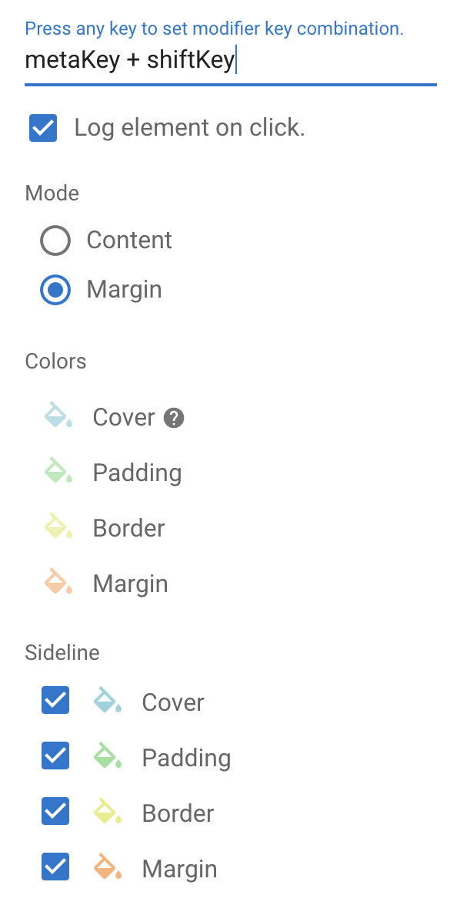

# Inspect Element

## Demo

## Usage

1. Install this extenstion from [Chrome WebStore](https://chrome.google.com/webstore/detail/inspect-element/flgcpmeleoikcibkiaiindbcjeldcogp)

2. Reload opening page

3. Hold Ctrl-Key / Command-Key and move your mouse to inspect element.
